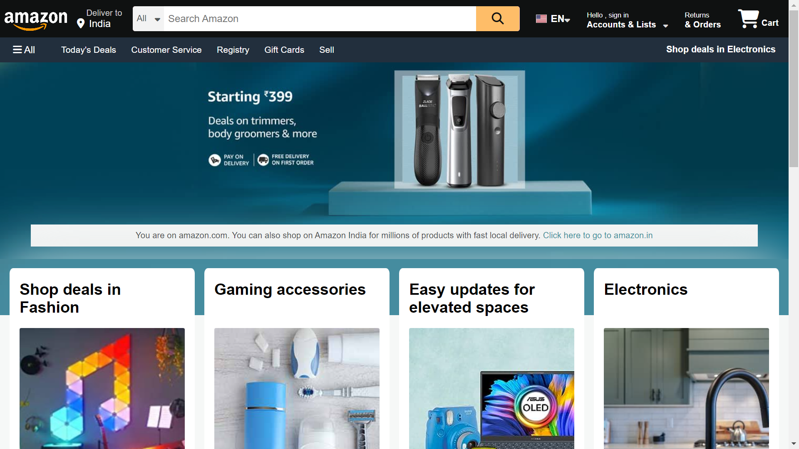

# Amazon Clone Website

Welcome to the Amazon Clone website project! This project is a simple representation of an e-commerce website inspired by Amazon, built using HTML and CSS.

## Project Website

Explore the project live on amazon-clone-010.onrender.com! click here &nbsp;&nbsp; &#8594; &nbsp;&nbsp;[](https://amazon-clone-010.onrender.com)


## Getting Started

1. Clone the repository:

   ```bash
   git clone https://github.com/gawandeabhishek/amazon_clone.git


